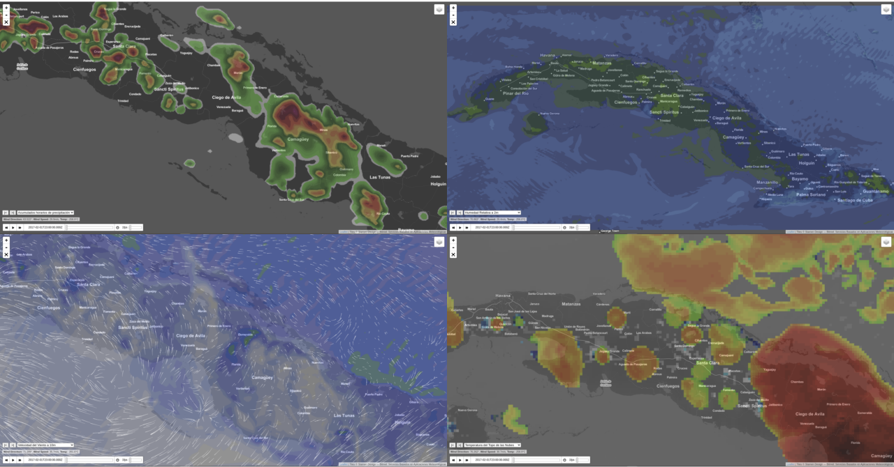

# bitmet_web_demo_products

<strong>Web visualization of Bitmet products derived from the WRF model</strong> 

 

Esta interfaz web permite visualizar de forma interactiva los datos derivados del modelo WRF (en formato JSON y PNG).

 

 
 

<strong>TODO:</strong> 

* Ver porque sale invertida en latitud la matriz de velocidad del viento que usa la animacion de particulas
* Ordenar el codigo
* Ver porque la animacion del viento se muestra algo desplazada al oeste o como que le falta algo al inicio, ver si es normal
* añadir a la interfaz web un selector de variables con botones y diseño mejor que el actual
* el control de anterior/siguiente migrarlo al que esta abajo con LeafletTime.Dimension
* En la parte derecha central añadir un espacio para mostrar la paleta de colores correspondiente a la variable mostrada, cada paleta esta en el direcotio ./paletas/*.png
* añadir mas variables
* revisar las paletas de colores
* quizas sea necesario añadir un control de opacidad junto al selector de variable o capas, porque en dependencia del mapa de fondo y las paletas de colores, algunas no se ven bien.
* la imagen png de la variable mostrada, quizas pueda optimizarse si se genera como una capa de tiles
* ver como se puede añadir un evento onclick sobre el mapa para capturar la coordenada y a partir de eso poder generar meteogramas.
* ver como cargar desde una cache local los conjuntos de tiles de la capa del mapa de fondo, para asi no depender de ningun servicio en internet, ya el resto de dependencias, imagnes, scripts, etc que el codigo original buscaba en internet esta local, solo faltarian las capas del mapa de fondo.

 

